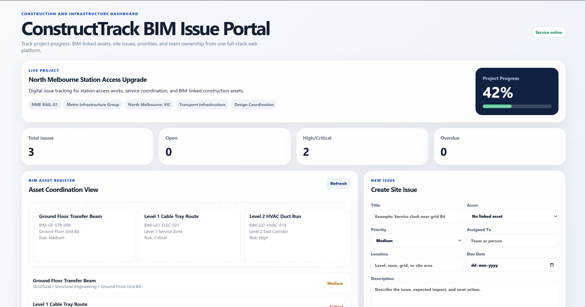
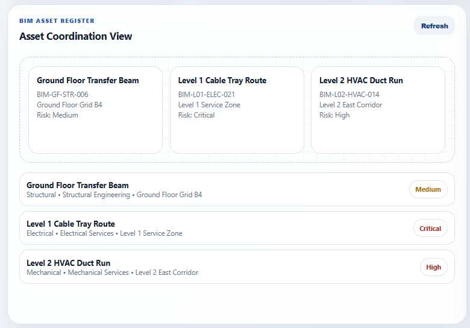
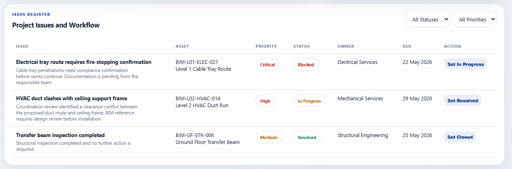
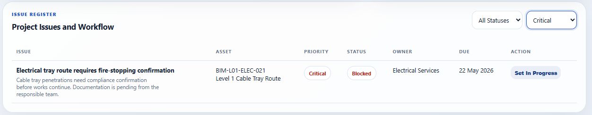
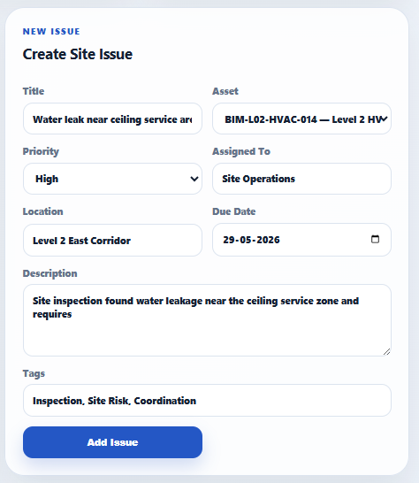
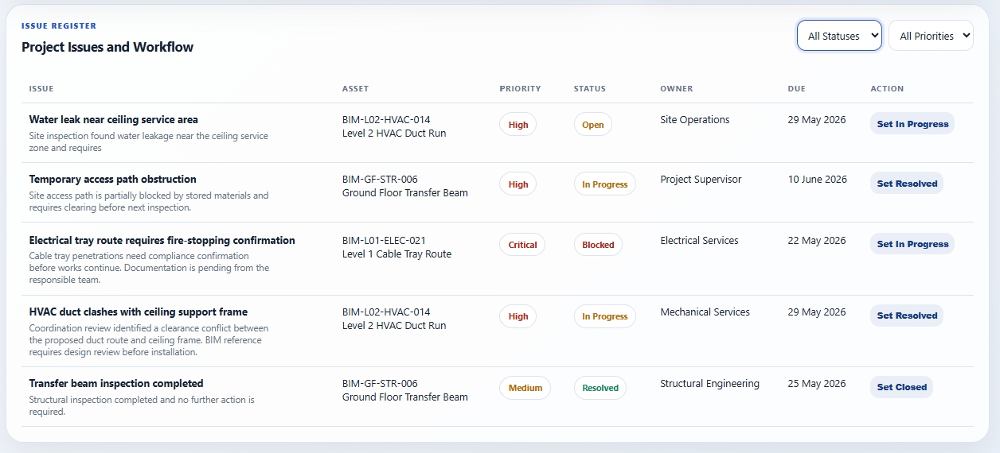
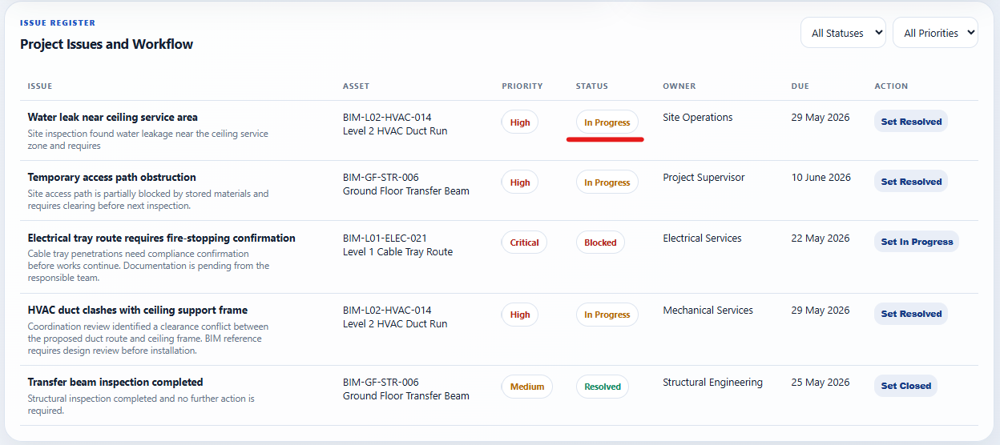
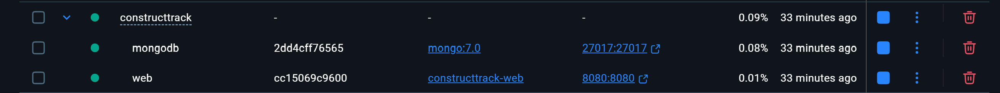
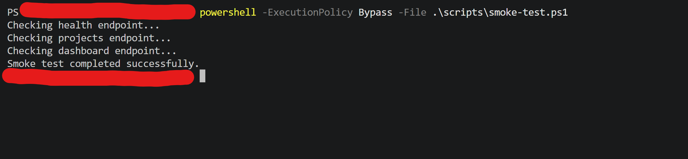

# ConstructTrack BIM Issue Portal

ConstructTrack is a full-stack web application for managing construction project issues, BIM-linked assets, workflow status, and project progress. It is designed for construction and infrastructure teams that need a clean dashboard for project coordination, defect tracking, asset visibility, and technical reporting.

## Key Features

- Construction project dashboard with progress and risk indicators
- BIM-style asset register using asset references, locations, teams, status, and risk levels
- Issue register for defects, coordination problems, safety risks, and compliance items
- REST API built with ASP.NET Core
- MongoDB document storage for projects, assets, issues, notes, and workflow history
- Static HTML, CSS, and JavaScript frontend served by the .NET application
- Filtering by issue status and priority
- Create issue workflow from the dashboard
- Update issue status directly from the issue register
- Docker Compose deployment with MongoDB and the web application
- Seed data included for immediate demonstration
- Documentation for architecture, API usage, deployment, and testing

## Technology Stack

| Area | Technology |
|---|---|
| Backend | ASP.NET Core / .NET 10 |
| Database | MongoDB |
| Data Access | MongoDB.Driver |
| Frontend | HTML, CSS, JavaScript |
| Deployment | Docker, Docker Compose |
| Hosting Path | IIS or AWS-ready via published .NET app/container |

## Project Structure

```text
ConstructTrack/
├── Dockerfile
├── docker-compose.yml
├── README.md
├── docs/
│   ├── API.md
│   ├── ARCHITECTURE.md
│   ├── DEPLOYMENT.md
│   └── TESTING.md
├── scripts/
│   ├── smoke-test.ps1
│   └── smoke-test.sh
└── src/
    └── ConstructTrack.Web/
        ├── Data/
        ├── Dtos/
        ├── Models/
        ├── Services/
        ├── wwwroot/
        ├── Program.cs
        └── ConstructTrack.Web.csproj
```

## Quick Start

### Prerequisites

- Docker Desktop or Docker Engine
- Git

### Run the Application

```bash
git clone <your-repository-url>
cd ConstructTrack
docker compose up --build
```

Open the application:

```text
http://localhost:8080
```

Health check:

```text
http://localhost:8080/health
```

Stop the application:

```bash
docker compose down
```

Remove the database volume and reset seed data:

```bash
docker compose down -v
```

## Local Development Without Docker

Start MongoDB locally on port `27017`, then run:

```bash
cd src/ConstructTrack.Web
dotnet restore
dotnet run
```

Default local database:

```text
constructtrack_dev
```

## Main API Endpoints

| Method | Endpoint | Purpose |
|---|---|---|
| GET | `/health` | Service health check |
| GET | `/api/dashboard` | Dashboard statistics |
| GET | `/api/projects` | List projects |
| POST | `/api/projects` | Create project |
| GET | `/api/projects/{projectId}/assets` | List project assets |
| POST | `/api/assets` | Create asset |
| GET | `/api/projects/{projectId}/issues` | List project issues |
| POST | `/api/issues` | Create issue |
| PUT | `/api/issues/{id}/status` | Update issue status |
| PUT | `/api/issues/{id}/assignment` | Update assignment |
| DELETE | `/api/issues/{id}` | Delete issue |

Full details are available in `docs/API.md`.

## Portfolio Positioning

This project demonstrates practical skills in:

- Full-stack web development
- ASP.NET Core API design
- MongoDB data modelling
- REST API integration
- Frontend dashboard development
- Construction and infrastructure workflow understanding
- BIM-style asset linking
- Docker-based deployment
- Technical documentation
- Testing and debugging workflow

## Application Screenshots

The screenshots below show the main workflow of ConstructTrack, including the project dashboard, BIM-linked asset register, construction issue tracking, filtering, issue creation, and testing.

### 1. Project Dashboard

The dashboard provides a high-level view of the active construction project, including total issues, open issues, high-risk items, overdue work, and project progress.



---

### 2. BIM-Linked Asset Register

The asset register links construction issues to BIM-style project components such as HVAC routes, structural elements, and electrical systems.



---

### 3. Construction Issue Register

The issue register displays active project issues with status, priority, linked asset, assigned team, due date, and workflow action.



---

### 4. Priority-Based Filtering

The dashboard supports filtering issues by priority and status, helping project teams quickly identify high-risk or blocked work items.



---

### 5. New Issue Creation

Users can create a new construction issue by selecting a linked asset, entering location details, assigning responsibility, setting priority, and adding tags.



---

### 6. Issue Created and Dashboard Updated

After submitting a new issue, the issue appears in the register and the dashboard statistics update using live MongoDB data.



---

### 7. Issue Workflow Update

Issues can be moved through workflow stages such as Open, In Progress, Blocked, and Resolved.



---

### 8. Docker Deployment

The project runs using Docker Compose, which starts both the ASP.NET Core web application and MongoDB database.



---

### 9. Smoke Test Result

Smoke tests verify that the health endpoint, project API, and dashboard API are running successfully.



