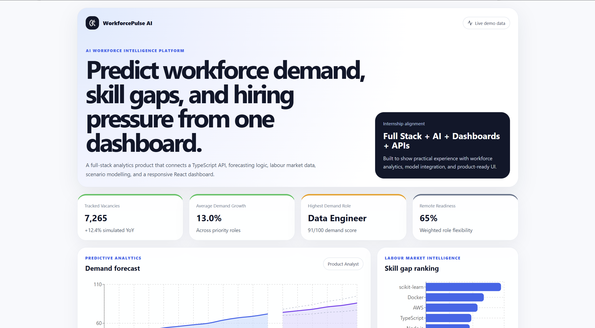

# WorkforcePulse AI

WorkforcePulse AI is a full-stack workforce analytics platform that demonstrates how AI forecasting, labour market intelligence, data visualization, and interactive decision-support tools can be integrated into a production-style web application.

The project was built to align with full-stack engineering internship responsibilities involving React/TypeScript interfaces, backend APIs, model integration, workforce datasets, dashboards, cloud-ready workflows, and clean software engineering practices.

---

## Preview

Add screenshots after running the app locally. Recommended screenshot names and capture instructions are listed in [`docs/SCREENSHOTS.md`](docs/SCREENSHOTS.md).

Suggested README preview layout after adding screenshots:

```md
| Dashboard Overview | Demand Forecast |
|---|---|
|  |  |

| Skill Gap Ranking | Scenario Simulator |
|---|---|
|  |  |
```

---

## Key Features

- Responsive React and TypeScript workforce analytics dashboard
- TypeScript Express API with clean route and service separation
- Simulated labour market dataset covering occupations, regions, skills, vacancies, salary, automation exposure, and demand drivers
- Forecasting service using lightweight linear regression over monthly demand trends
- Skill gap ranking based on projected demand versus current supply
- Scenario simulator for workforce training and hiring intervention planning
- AI-style insights generated from labour market and skill gap data
- API validation using Zod
- Server-side unit tests with Vitest
- Docker Compose support for local containerized development
- GitHub Actions CI workflow for build and test checks

---

## Tech Stack

### Frontend

- React
- TypeScript
- Vite
- Recharts
- Lucide React
- CSS responsive layout

### Backend

- Node.js
- Express
- TypeScript
- Zod validation
- Vitest testing

### DevOps / Workflow

- Docker Compose
- GitHub Actions
- REST API architecture
- Environment-based configuration

---

## Project Architecture

```txt
workforcepulse-ai/
├── client/                  # React + TypeScript dashboard
│   ├── src/components/       # UI components
│   ├── src/services/         # API client functions
│   ├── src/types/            # Frontend TypeScript models
│   └── src/App.tsx           # Dashboard composition
├── server/                  # TypeScript Express API
│   ├── src/data/             # Simulated labour market dataset
│   ├── src/routes/           # REST API routes
│   ├── src/services/         # Forecasting, skill gap, scenario logic
│   ├── src/models/           # Backend TypeScript models
│   └── tests/                # Unit tests
├── docs/                    # API and screenshot documentation
├── docker-compose.yml        # Optional containerized local development
└── .github/workflows/ci.yml  # CI pipeline
```

---

## How It Works

1. The backend exposes REST APIs for labour market records, forecasts, skill gaps, insights, and scenario simulation.
2. The forecasting service takes monthly occupation demand data and predicts future demand using a lightweight regression model.
3. The skill gap service compares current skill supply against projected demand and ranks skills by priority.
4. The scenario service estimates the impact of training seats and program duration on the workforce gap.
5. The frontend consumes these APIs and presents the results through dashboard cards, charts, tables, and interactive simulation controls.

---

## Getting Started

### Prerequisites

Install the following:

- Node.js 20 or later
- npm 10 or later

No paid API key, external account, or cloud subscription is required.

---

## Run Locally

### 1. Clone the repository

```bash
git clone https://github.com/your-username/workforcepulse-ai.git
cd workforcepulse-ai
```

### 2. Install all dependencies

```bash
npm install
npm run install:all
```

### 3. Start the full-stack app

```bash
npm run dev
```

### 4. Open the app

Frontend:

```txt
http://localhost:5173
```

Backend health check:

```txt
http://localhost:4000/api/health
```

---

## Run with Docker Compose

```bash
docker compose up --build
```

Then open:

```txt
http://localhost:5173
```

---

## Useful Commands

```bash
# Run backend tests
npm run test

# Build frontend and backend
npm run build

# Run only backend
npm run dev --prefix server

# Run only frontend
npm run dev --prefix client
```

---

## Main API Endpoints

| Method | Endpoint | Purpose |
|---|---|---|
| GET | `/api/health` | API health check |
| GET | `/api/analytics/summary` | Dashboard KPI metrics |
| GET | `/api/analytics/occupations` | Labour market occupation records |
| GET | `/api/analytics/forecast/:occupationId` | Forecast for selected occupation |
| GET | `/api/analytics/skills` | Skill gap ranking |
| GET | `/api/analytics/insights` | AI-style workforce recommendations |
| POST | `/api/analytics/scenario` | Training and workforce intervention simulator |

Detailed API examples are available in [`docs/API.md`](docs/API.md).

---

## Example Scenario Request

```json
{
  "occupationIds": ["fs-dev", "ml-eng"],
  "trainingSeats": 120,
  "months": 12,
  "region": "VIC"
}
```

Example output:

```json
{
  "projectedFilledRoles": 86,
  "remainingGap": 20,
  "roiScore": 81,
  "recommendedAction": "Scale the training program and connect graduates directly to high-demand roles."
}
```

---

## Screenshots to Add

After running the app, capture and add these screenshots inside `docs/screenshots/`:

1. `dashboard-overview.png` - hero section and KPI cards
2. `demand-forecast.png` - forecast chart for a selected occupation
3. `skill-gap-ranking.png` - skill gap chart and priority list
4. `occupation-table.png` - occupation dataset table
5. `scenario-simulator.png` - scenario simulator after running a result
6. `api-health.png` - backend API health response
7. `mobile-view.png` - optional responsive mobile layout

Full screenshot guidance is available in [`docs/SCREENSHOTS.md`](docs/SCREENSHOTS.md).

---

## Resume Description

Built WorkforcePulse AI, a full-stack workforce analytics platform using React, TypeScript, Node.js, Express, REST APIs, and data visualization. The project integrates simulated labour market datasets, forecasting logic, skill gap analysis, and an interactive scenario simulator to support workforce planning and decision-making.

---

## What This Project Demonstrates

- Full-stack web application development
- Frontend dashboard and data visualization skills
- Backend API design and validation
- AI/ML workflow understanding through model-output integration
- Labour market and workforce analytics product thinking
- Clean code structure and maintainable engineering practices
- Testing, documentation, Docker, and CI workflow awareness

---

## Notes

This project uses simulated labour market data for demonstration purposes. It does not require external labour market APIs or paid AI model APIs. The architecture is intentionally designed so real datasets, authentication, cloud storage, or production ML models can be added later.
